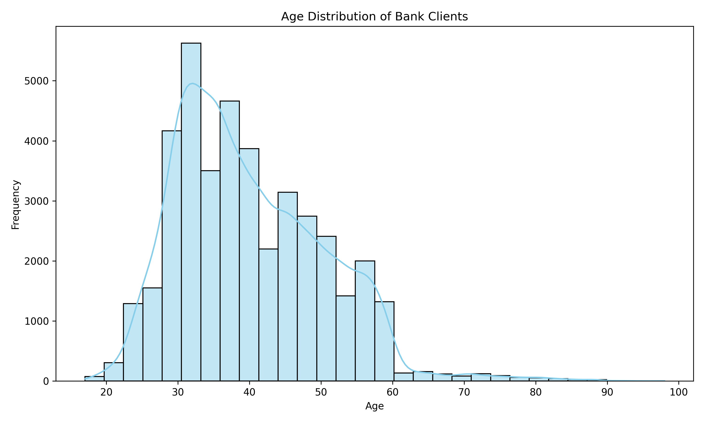
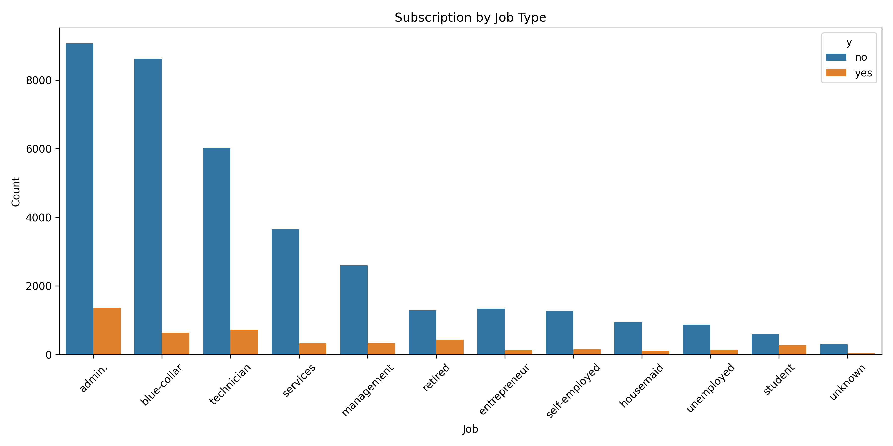

🏦 Bank Marketing Data Analysis

This project analyzes the Bank Marketing Dataset to understand customer behavior and identify the key factors influencing term deposit subscriptions.
It focuses on data exploration, visualization, and insight generation to support smarter marketing strategies in the banking domain.

📊 Project Overview

The goal of this project is to:

Discover trends and correlations between customer demographics and subscription outcomes.

Identify which marketing attributes contribute most to successful deposits.

Visualize important business insights clearly and interactively.

The dataset used comes from a Portuguese banking institution and contains details of marketing campaigns, client attributes, and call outcomes.

🧠 Key Insights Generated

Age Distribution: Understand which age groups are more likely to subscribe.

Job Type vs Subscription: Analyze professional background trends.

Education Level Impact: Discover how education influences deposit decisions.

Correlation Heatmap: Explore numeric relationships among campaign features.

These insights provide actionable findings to help banks optimize customer targeting and improve conversion rates.

🧰 Tech Stack
Category	Tools / Libraries
Programming	Python 3.10+
Data Analysis	Pandas, NumPy
Data Visualization	Matplotlib, Seaborn
Optional ML / Stats	Scikit-learn (for modeling correlations)
Environment	VS Code, Jupyter, venv
📁 Project Structure
bank-marketing-tree/
│
├── bank_marketing_data/           # Contains datasets (.csv files)
│   ├── bank_data/
│   ├── bank_additional_data/
│
├── visuals/                       # Saved charts (auto-generated)
│
├── analyze_bank_data.py           # Data summary and exploration
├── analyze_bank_insights.py       # Visualization and insights
├── analyze_bank_trends.py         # Trends, charts, correlations
│
├── requirements.txt               # Python dependencies
├── README.md                      # Project documentation
└── LICENSE                        # MIT License

📈 Sample Visuals

(Once you push your charts, they’ll appear here!)
Add your generated charts by uploading PNGs to your visuals/ folder and linking them like this:

🚀 How to Run This Project
Step 1: Clone the repository
git clone https://github.com/soumyahxx-hub/PRODIGY_DS_02.git
cd PRODIGY_DS_02

Step 2: Create and activate a virtual environment
python -m venv venv
venv\Scripts\activate     # for Windows

Step 3: Install dependencies
pip install -r requirements.txt

Step 4: Run analysis scripts
python analyze_bank_data.py
python analyze_bank_insights.py
python analyze_bank_trends.py

Visuals will be saved automatically in the visuals/ folder.

💡 Future Enhancements

Add predictive models (Logistic Regression, Random Forest).

Build an interactive dashboard using Streamlit or Power BI.

Automate report generation with dynamic visuals.

👨‍💻 Author

Soumyadeep Guha
📍 Data Science | Machine Learning | Analytics
🔗 GitHub Profile

⚖️ License

This project is licensed under the MIT License — see the LICENSE file for details.
